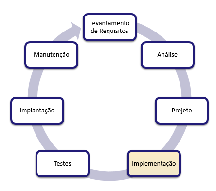
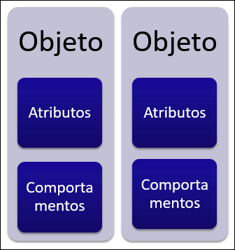
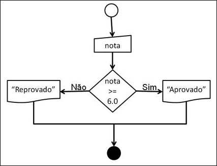

# Introdução à Programação - Unidade 1

## Fundamentos da Programação de Computadores
> Vídeo aula (1_VideoAula-1 14:06):
> [https://web.microsoftstream.com/video/4e5ecb83-7e7b-49c8-bb9e-3136e7269631](https://web.microsoftstream.com/video/4e5ecb83-7e7b-49c8-bb9e-3136e7269631
> "primeira Video Aula da unidade 1") 
> Vídeo aula (1_VideoAula-1 14:06): [link
> alternativo](https://furb-my.sharepoint.com/:v:/g/personal/dalton_furb_br/EdPfGQHjAiZGnMaWvq221ngBMk--zVdGuwCtr0-6TZXPJw?e=UHYpHy
> "link alternativo da primeira Video Aula da unidade 1")
>  

- Os computadores são máquinas programáveis utilizadas para automatizar tarefas​.
- As ações executadas por estas máquinas são baseadas em dados e regras que dependem da aplicação para as quais são criadas​.
- A programação de um computador é uma tarefa executada pelo programador​.

### Solução de Problemas
- O computador segue as ordens (**comandos** e **instruções**) contidas em um programa de computador e escritas em uma linguagem de programação​.
- A sequência lógica e coerente destas ordens é representada através de Algoritmos, Fluxogramas ou Diagramas​.
- A implementação destas ordens em uma linguagem computacional é denominada de Programa de Computador​.

##### Imagem do bolo confeitado 

##### Imagem cozinhando macarrão 

- **A solução de um problema** com base em um **software** envolve um conjunto de **processos** (regras) que operam sobre **dados**, necessitando de **recursos** (dados de Entrada) e produzindo **resultados** (dados de Saídas)​.
- **Processos** (regras) são as ações executadas pelo computador para operar ou transformar os dados.

##### Imagem das etapas: Entrada, Processo e Saída 

### Exercícios
- Responda o quiz no AVA3​.
- Acompanhe os exercício em sala​.

----------

## Fundamentos da Programação de Computadores
> Vídeo aula (1_VideoAula-2 18:57):
> [https://web.microsoftstream.com/video/3725cdf1-320c-4b38-a078-3c90fc3816b0](https://web.microsoftstream.com/video/3725cdf1-320c-4b38-a078-3c90fc3816b0
> "segundo Video Aula da unidade 1") 
> Vídeo aula (1_VideoAula-2 18:57): [link
> alternativo](https://web.microsoftstream.com/video/3725cdf1-320c-4b38-a078-3c90fc3816b0
> "link alternativo da segunda Video Aula da unidade 1")
>  

### Ciclo de Vida de um Software​
- O **desenvolvimento de um software** é realizado em diversas etapas denominadas de ciclo de vida.
- As etapas mais comuns do ciclo de vida de um software são:​
  - **levantamento de requisitos**: consiste no levantamento das funcionalidades que se deseja para o software. É o momento de se compreender o problema. Estabelece o que se chama de domínio do problema;​
  - **análise**: consiste na elaboração dos modelos que irão representar o sistema a ser desenvolvido. É feita com base nos requisitos estabelecidos na etapa anterior.​
  - **projeto**: consiste na concepção de como o sistema deve funcionar, definindo características tecnológicas e de arquitetura do sistema e  as estruturas de dados e de controle a serem utilizadas ou construídas.​
  - **implementação**: consiste na codificação dos programas necessários para que o software funcione adequadamente;​
  - **testes**: consiste nos testes do software para verificar se ele atende os requisitos e necessidades para o qual foi proposto;​
  - **implantação**: consiste em colocar o software em funcionamento para o seu usuário ou grupo de usuários;
  - **manutenção**: consiste em operações de atualização ou correção do software.​

##### Imagem do Clico de Vida de um Software 

### Métodos de Especificação de Problemas
- As abordagens mais comuns para o desenvolvimento de software atualmente são:​
  - **estruturada**: neste método, os dados são modelados separados das funções. Assim, normalmente modelam-se os dados com diagramas de entidades e relacionamentos e as funções através de diagramas de fluxo de dados.​
  - **orientada a objetos**: neste método, dados e funções são modelados juntos, buscando-se representações próximas ao mundo real. Normalmente, os problemas são modelados através de diagramas da UML (Unified Modeling Language)​.
- A definição da metodologia de desenvolvimento influencia diretamente na etapa de codificação dos programas, definindo, portanto, a forma que se deve fazer a Programação do Software​.
  - Abordagem Estruturada  

  - Abordagem Orientada a Objetos 

### Técnicas para Representação de Soluções
- As principais técnicas para representações de soluções de problemas com base em softwares são:
  - Algoritmos, Fluxogramas ou Diagramas;​
- **NÃO EXIGEM** um computador para serem executados e testados.​

### Algoritmos​
- Representam as instruções para a solução de um problema com base em um subconjunto de palavras de uma língua (p. ex. língua portuguesa).
- Também são conhecidos por [pseudolinguagem](https://pt.wikipedia.org/wiki/Pseudocódigo "pseudolinguagem é uma linguagem hipotética,que tem por objetivo ser um instrumento didático para auxiliar na dinâmica ensino-aprendizado. Ela contém os principais elementos encontrados em praticamente todas as linguagens reais de programação de computadores.") ou pseudocódigo.
- Tem uma estrutura semântica e sintática própria, mas que pode variar nas diferentes bibliografias ou formas de representação
- **Vantagem**: facilidade de elaboração.​
- **Desvantagem**: legibilidade e ambiguidade em problemas não triviais.​
##### Imagem de exemplo de um algoritmo 

### Fluxogramas (Diagrama de Blocos)​
- É o tipo mais comum de representação de solução de problemas com base em uma notação gráfica.​
- Contêm um conjunto de símbolos com significados específicos para cada instrução.​
- **Vantagem**: legibilidade.​
- **Desvantagens**: espaço e ferramentas para elaboração.​
##### Imagem de exemplo de um fluxograma 

### Diagramas​
- Outros tipos de diagramas também permitem a representação de soluções de problemas com base em notações gráficas.​
##### Diagrama de Chapin (Nassi-Shneiderman) 
")
##### Diagrama de Estados 

### Solução de Problemas​
- A solução de um problema computacional requer:​
  - **busca de outras experiências e soluções para problemas semelhantes**: soluções já existentes podem e devem ser consultadas antes de se tentar propor uma nova solução.
  - **divisão e conquista**: ao se deparar com um problema complexo, tenta-se reduzi-lo a problemas menores e mais fáceis de serem tratados.
  - **diversidade de soluções**: não é aconselhável comprometer-se imediatamente com uma única solução. Durante a solução do problema podem ser obtidas novas informações que permitirão a existência de novas alternativas.
  - **a boa escolha de uma linguagem de programação**: as linguagens de programação tem suas características específicas, sendo mais ou menos adequadas para cada tipo de problema. O programador deve conhecer profundamente a linguagem escolhida para implementar um programa.
- Para ser um bom Programador é necessário:​
  - estudar soluções algorítmicas clássicas descritas na literatura.
  - conhecer as estruturas e recursos oferecidos pelos ambientes e linguagens de programação.
  - programar, programar e programar.
- A tarefa fundamental do Programador é desenvolver ou aplicar os melhores algoritmos para cada situação-problema requeridos na construção de um software, utilizando a linguagem de programação mais adequada.​

### Exercícios
- Responda o quiz no AVA3​.
- Acompanhe os exercício em sala​.

----------

### [Principais Referências Bibliográficas​](#referencia)
- CARBONI, Irenice de Fátima. **[Lógica de programação](https://bu.furb.br/consulta/portalConsulta/recuperaMfnCompleto.php?menu=rapida&CdMFN=265888)**. São Paulo : Pioneira Thomson Learning, 2003. 240 p, il.​
- MANZANO, José Augusto N. G; OLIVEIRA, Jayr Figueiredo de. **[Algoritmos: lógica para desenvolvimento de programação](https://bu.furb.br/consulta/portalConsulta/recuperaMfnCompleto.php?menu=rapida&CdMFN=98280)**. São Paulo : Erica, 1996. 265p.​
- SOUZA, Marco Antônio Furlan de. **[Algoritmos e lógica de programação](https://bu.furb.br/consulta/portalConsulta/recuperaMfnCompleto.php?menu=rapida&CdMFN=306850)**. São Paulo : Pioneira Thomson, 2005. xxiii, 214 p, il.
- VILARIM, Gilvan de Oliveira.
  **[Algoritmos: programação para iniciantes.](https://bu.furb.br/consulta/portalConsulta/recuperaMfnCompleto.php?menu=rapida&CdMFN=319911)**
  2. ed. Rio de Janeiro : Ciência Moderna, 2004. xiv, 270 p, il.​
- XAVIER, Gley Fabiano Cardoso. **[Lógica de programação](https://bu.furb.br/consulta/portalConsulta/recuperaMfnCompleto.php?menu=rapida&CdMFN=267002)**. 7. ed. São Paulo : SENAC, 2004. xxv, 378 p, il. 1 CD-ROM. (Nova série informática).​
----------